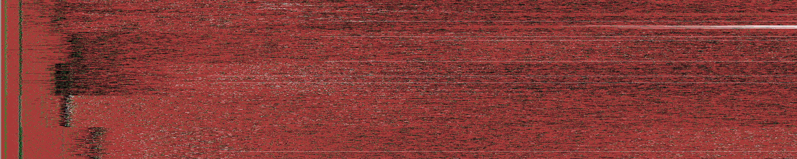

# Phase 2
The second phase of this project took an unexpected turn due to the ongoing
pandemic. As luck would have it (?), we were able to spend a large part of
spring letting simulations run while we were distracted with other
pandemic-related activities at work.

Below first presents a manually created straw-man machine that's a reasonably
effective but highly inefficient (in terms of overhead) defense against the Deep
Fingerprinting attack. We then evaluate five evolved machines and end phase 2
with a discussion on the challenges of creating efficient and effective
machines.

## Strawman machine
You can find the strawman machine in `strawman-mc` and `strawman-mr`. 

Computed overhead (efficiency):
```
in total for 20000 traces:
	- 98380498 cells
	- 423% average total bandwidth
	- 8270953 sent cells (8%)
		- 2417024 nonpadding
		- 5853929 padding
		- 342% average sent bandwidth
	- 90109545 recv cells (92%)
		- 20826484 nonpadding
		- 69283061 padding
		- 433% average recv bandwidth
```

Evaluated effectiveness:
```
made 2000 predictions with 2000 labels
	threshold  0.0, recall 0.67, precision 0.66, F1 0.66, accuracy 0.74   [tp   669, fpp   152, fnp   198, tn   802, fn   179]
	threshold 0.11, recall 0.67, precision 0.66, F1 0.66, accuracy 0.74   [tp   669, fpp   152, fnp   198, tn   802, fn   179]
	threshold 0.35, recall 0.66, precision 0.66, F1 0.66, accuracy 0.74   [tp   664, fpp   144, fnp   192, tn   808, fn   192]
	threshold 0.53, recall 0.62, precision 0.72, F1 0.67, accuracy 0.74   [tp   620, fpp   102, fnp   142, tn   858, fn   278]
	threshold 0.66, recall 0.56, precision 0.78, F1 0.65, accuracy 0.73   [tp   565, fpp    66, fnp    96, tn   904, fn   369]
	threshold 0.75, recall 0.52, precision 0.82, F1 0.64, accuracy 0.73   [tp   522, fpp    48, fnp    70, tn   930, fn   430]
	threshold 0.82, recall 0.48, precision 0.85, F1 0.61, accuracy 0.72   [tp   482, fpp    37, fnp    49, tn   951, fn   481]
	threshold 0.87, recall 0.44, precision 0.87, F1 0.59, accuracy  0.7   [tp   444, fpp    25, fnp    40, tn   960, fn   531]
	threshold 0.91, recall 0.39, precision 0.89, F1 0.55, accuracy 0.68   [tp   393, fpp    20, fnp    28, tn   972, fn   587]
	threshold 0.93, recall 0.35, precision 0.92, F1 0.51, accuracy 0.67   [tp   350, fpp    14, fnp    17, tn   983, fn   636]
	threshold 0.95, recall 0.32, precision 0.93, F1 0.47, accuracy 0.65   [tp   318, fpp     8, fnp    15, tn   985, fn   674]
	threshold 0.96, recall 0.29, precision 0.94, F1 0.44, accuracy 0.64   [tp   287, fpp     6, fnp    11, tn   989, fn   707]
	threshold 0.97, recall 0.25, precision 0.95, F1 0.39, accuracy 0.62   [tp   248, fpp     4, fnp     8, tn   992, fn   748]
	threshold 0.98, recall  0.2, precision 0.96, F1 0.34, accuracy  0.6   [tp   205, fpp     4, fnp     5, tn   995, fn   791]
	threshold 0.99, recall 0.18, precision 0.96, F1  0.3, accuracy 0.59   [tp   180, fpp     4, fnp     3, tn   997, fn   816]
	threshold 0.99, recall 0.15, precision 0.97, F1 0.27, accuracy 0.58   [tp   155, fpp     3, fnp     1, tn   999, fn   842]

```

Visualized (black/white = received/sent nonpadding, red/green = received/sent padding):



## Evolved machines

During spring we've been using [genetic
programming](https://en.wikipedia.org/wiki/Genetic_programming) to evolve
machines with varying success. Below are highlights from February-June. The
machines can be found in this repo (e.g, ``may-mc`` is the client-side machine
and ``may-mr`` the relay-side machine picked from the May batch).

### February
Computed overhead (efficiency):
```
in total for 20000 traces:
	- 93903443 cells
	- 173% average total bandwidth
	- 45282284 sent cells (48%)
		- 5541979 nonpadding
		- 39740305 padding
		- 817% average sent bandwidth
	- 48621159 recv cells (52%)
		- 48621159 nonpadding
		- 0 padding
		- 100% average recv bandwidth
```

Evaluated effectiveness:
```
made 2000 predictions with 2000 labels
	threshold  0.0, recall 0.79, precision 0.79, F1 0.79, accuracy 0.82   [tp   792, fpp    58, fnp   156, tn   844, fn   150]
	threshold 0.11, recall 0.79, precision 0.79, F1 0.79, accuracy 0.82   [tp   792, fpp    58, fnp   156, tn   844, fn   150]
	threshold 0.35, recall 0.79, precision 0.79, F1 0.79, accuracy 0.82   [tp   791, fpp    54, fnp   155, tn   845, fn   155]
	threshold 0.53, recall 0.77, precision 0.83, F1  0.8, accuracy 0.83   [tp   771, fpp    43, fnp   117, tn   883, fn   186]
	threshold 0.66, recall 0.74, precision 0.87, F1  0.8, accuracy 0.83   [tp   742, fpp    32, fnp    79, tn   921, fn   226]
	threshold 0.75, recall 0.71, precision  0.9, F1 0.79, accuracy 0.82   [tp   713, fpp    18, fnp    65, tn   935, fn   269]
	threshold 0.82, recall 0.69, precision 0.92, F1 0.79, accuracy 0.82   [tp   691, fpp    13, fnp    50, tn   950, fn   296]
	threshold 0.87, recall 0.67, precision 0.93, F1 0.78, accuracy 0.81   [tp   665, fpp     7, fnp    41, tn   959, fn   328]
	threshold 0.91, recall 0.64, precision 0.95, F1 0.77, accuracy 0.81   [tp   643, fpp     5, fnp    28, tn   972, fn   352]
	threshold 0.93, recall 0.61, precision 0.97, F1 0.75, accuracy  0.8   [tp   611, fpp     4, fnp    17, tn   983, fn   385]
	threshold 0.95, recall 0.59, precision 0.98, F1 0.74, accuracy 0.79   [tp   591, fpp     1, fnp    14, tn   986, fn   408]
	threshold 0.96, recall 0.56, precision 0.98, F1 0.71, accuracy 0.77   [tp   560, fpp     0, fnp    14, tn   986, fn   440]
	threshold 0.97, recall 0.53, precision 0.98, F1 0.69, accuracy 0.76   [tp   528, fpp     0, fnp    11, tn   989, fn   472]
	threshold 0.98, recall  0.5, precision 0.99, F1 0.66, accuracy 0.74   [tp   496, fpp     0, fnp     7, tn   993, fn   504]
	threshold 0.99, recall 0.47, precision 0.99, F1 0.64, accuracy 0.73   [tp   475, fpp     0, fnp     6, tn   994, fn   525]
	threshold 0.99, recall 0.45, precision 0.99, F1 0.62, accuracy 0.72   [tp   453, fpp     0, fnp     3, tn   997, fn   547]
```

Visualized (black/white = received/sent nonpadding, red/green = received/sent padding):


### March
Computed overhead (efficiency):
```
in total for 20000 traces:
	- 93650485 cells
	- 173% average total bandwidth
	- 45058504 sent cells (48%)
		- 5523802 nonpadding
		- 39534702 padding
		- 816% average sent bandwidth
	- 48591981 recv cells (52%)
		- 48591981 nonpadding
		- 0 padding
		- 100% average recv bandwidth
```

Evaluated effectiveness:
```
 made 2000 predictions with 2000 labels
	threshold  0.0, recall 0.86, precision 0.79, F1 0.82, accuracy 0.84   [tp   860, fpp    53, fnp   179, tn   821, fn    87]
	threshold 0.11, recall 0.86, precision 0.79, F1 0.82, accuracy 0.84   [tp   860, fpp    53, fnp   179, tn   821, fn    87]
	threshold 0.35, recall 0.86, precision 0.79, F1 0.82, accuracy 0.84   [tp   858, fpp    51, fnp   174, tn   826, fn    91]
	threshold 0.53, recall 0.84, precision 0.82, F1 0.83, accuracy 0.85   [tp   841, fpp    39, fnp   140, tn   860, fn   120]
	threshold 0.66, recall 0.82, precision 0.86, F1 0.84, accuracy 0.86   [tp   816, fpp    30, fnp   105, tn   895, fn   154]
	threshold 0.75, recall 0.79, precision 0.89, F1 0.84, accuracy 0.86   [tp   791, fpp    23, fnp    75, tn   925, fn   186]
	threshold 0.82, recall 0.77, precision 0.91, F1 0.84, accuracy 0.86   [tp   774, fpp    14, fnp    63, tn   937, fn   212]
	threshold 0.87, recall 0.75, precision 0.92, F1 0.83, accuracy 0.85   [tp   751, fpp    12, fnp    52, tn   948, fn   237]
	threshold 0.91, recall 0.73, precision 0.93, F1 0.82, accuracy 0.84   [tp   731, fpp     9, fnp    42, tn   958, fn   260]
	threshold 0.93, recall 0.71, precision 0.94, F1 0.81, accuracy 0.84   [tp   714, fpp     7, fnp    35, tn   965, fn   279]
	threshold 0.95, recall 0.69, precision 0.95, F1  0.8, accuracy 0.83   [tp   687, fpp     4, fnp    29, tn   971, fn   309]
	threshold 0.96, recall 0.67, precision 0.96, F1 0.79, accuracy 0.82   [tp   665, fpp     2, fnp    24, tn   976, fn   333]
	threshold 0.97, recall 0.64, precision 0.97, F1 0.77, accuracy 0.81   [tp   640, fpp     2, fnp    19, tn   981, fn   358]
	threshold 0.98, recall 0.62, precision 0.97, F1 0.76, accuracy  0.8   [tp   620, fpp     2, fnp    15, tn   985, fn   378]
	threshold 0.99, recall  0.6, precision 0.98, F1 0.74, accuracy 0.79   [tp   596, fpp     0, fnp    11, tn   989, fn   404]
	threshold 0.99, recall 0.57, precision 0.99, F1 0.72, accuracy 0.78   [tp   571, fpp     0, fnp     7, tn   993, fn   429]
```

Visualized (black/white = received/sent nonpadding, red/green = received/sent padding):


### April

Computed overhead (efficiency):
```
in total for 20000 traces:
	- 94826361 cells
	- 206% average total bandwidth
	- 18200498 sent cells (19%)
		- 4595186 nonpadding
		- 13605312 padding
		- 396% average sent bandwidth
	- 76625863 recv cells (81%)
		- 41469289 nonpadding
		- 35156574 padding
		- 185% average recv bandwidth
```

Evaluated effectiveness:
```
made 2000 predictions with 2000 labels
	threshold  0.0, recall 0.57, precision 0.52, F1 0.54, accuracy 0.61   [tp   566, fpp   192, fnp   339, tn   661, fn   242]
	threshold 0.11, recall 0.57, precision 0.52, F1 0.54, accuracy 0.61   [tp   566, fpp   192, fnp   339, tn   661, fn   242]
	threshold 0.35, recall 0.56, precision 0.54, F1 0.55, accuracy 0.63   [tp   557, fpp   170, fnp   305, tn   695, fn   273]
	threshold 0.53, recall 0.51, precision 0.62, F1 0.56, accuracy 0.65   [tp   514, fpp   104, fnp   214, tn   786, fn   382]
	threshold 0.66, recall 0.46, precision 0.69, F1 0.55, accuracy 0.66   [tp   459, fpp    67, fnp   143, tn   857, fn   474]
	threshold 0.75, recall 0.41, precision 0.76, F1 0.53, accuracy 0.66   [tp   412, fpp    42, fnp    88, tn   912, fn   546]
	threshold 0.82, recall 0.37, precision 0.81, F1 0.51, accuracy 0.65   [tp   370, fpp    27, fnp    62, tn   938, fn   603]
	threshold 0.87, recall 0.33, precision 0.85, F1 0.48, accuracy 0.65   [tp   333, fpp    18, fnp    39, tn   961, fn   649]
	threshold 0.91, recall  0.3, precision 0.89, F1 0.45, accuracy 0.64   [tp   299, fpp     9, fnp    27, tn   973, fn   692]
	threshold 0.93, recall 0.27, precision 0.91, F1 0.41, accuracy 0.62   [tp   266, fpp     7, fnp    19, tn   981, fn   727]
	threshold 0.95, recall 0.24, precision 0.93, F1 0.38, accuracy 0.61   [tp   239, fpp     5, fnp    13, tn   987, fn   756]
	threshold 0.96, recall 0.21, precision 0.95, F1 0.35, accuracy  0.6   [tp   214, fpp     4, fnp     7, tn   993, fn   782]
	threshold 0.97, recall  0.2, precision 0.96, F1 0.32, accuracy 0.59   [tp   195, fpp     3, fnp     6, tn   994, fn   802]
	threshold 0.98, recall 0.17, precision 0.97, F1 0.29, accuracy 0.58   [tp   172, fpp     1, fnp     4, tn   996, fn   827]
	threshold 0.99, recall 0.16, precision 0.99, F1 0.27, accuracy 0.58   [tp   158, fpp     0, fnp     2, tn   998, fn   842]
	threshold 0.99, recall 0.14, precision 0.99, F1 0.24, accuracy 0.57   [tp   137, fpp     0, fnp     2, tn   998, fn   863]
```

Visualized (black/white = received/sent nonpadding, red/green = received/sent padding):


### May

Computed overhead (efficiency):
```
in total for 20000 traces:
	- 94120054 cells
	- 182% average total bandwidth
	- 22873433 sent cells (24%)
		- 5209962 nonpadding
		- 17663471 padding
		- 439% average sent bandwidth
	- 71246621 recv cells (76%)
		- 46600783 nonpadding
		- 24645838 padding
		- 153% average recv bandwidth
```

Evaluated effectiveness:
```
made 2000 predictions with 2000 labels
	threshold  0.0, recall 0.71, precision 0.64, F1 0.67, accuracy 0.71   [tp   710, fpp   120, fnp   288, tn   712, fn   170]
	threshold 0.11, recall 0.71, precision 0.64, F1 0.67, accuracy 0.71   [tp   710, fpp   120, fnp   288, tn   712, fn   170]
	threshold 0.35, recall  0.7, precision 0.65, F1 0.68, accuracy 0.72   [tp   705, fpp   104, fnp   274, tn   726, fn   191]
	threshold 0.53, recall 0.67, precision 0.71, F1 0.69, accuracy 0.74   [tp   670, fpp    76, fnp   192, tn   808, fn   254]
	threshold 0.66, recall 0.62, precision 0.77, F1 0.69, accuracy 0.75   [tp   623, fpp    55, fnp   129, tn   871, fn   322]
	threshold 0.75, recall 0.58, precision 0.82, F1 0.68, accuracy 0.75   [tp   585, fpp    34, fnp    91, tn   909, fn   381]
	threshold 0.82, recall 0.54, precision 0.86, F1 0.67, accuracy 0.74   [tp   544, fpp    26, fnp    59, tn   941, fn   430]
	threshold 0.87, recall 0.51, precision 0.89, F1 0.65, accuracy 0.73   [tp   512, fpp    16, fnp    47, tn   953, fn   472]
	threshold 0.91, recall 0.47, precision 0.92, F1 0.62, accuracy 0.72   [tp   471, fpp    13, fnp    28, tn   972, fn   516]
	threshold 0.93, recall 0.43, precision 0.93, F1 0.59, accuracy 0.71   [tp   434, fpp    11, fnp    23, tn   977, fn   555]
	threshold 0.95, recall 0.39, precision 0.94, F1 0.55, accuracy 0.69   [tp   392, fpp     7, fnp    16, tn   984, fn   601]
	threshold 0.96, recall 0.35, precision 0.96, F1 0.51, accuracy 0.67   [tp   349, fpp     5, fnp    10, tn   990, fn   646]
	threshold 0.97, recall  0.3, precision 0.97, F1 0.46, accuracy 0.65   [tp   303, fpp     3, fnp     7, tn   993, fn   694]
	threshold 0.98, recall 0.27, precision 0.98, F1 0.43, accuracy 0.63   [tp   272, fpp     2, fnp     4, tn   996, fn   726]
	threshold 0.99, recall 0.25, precision 0.98, F1  0.4, accuracy 0.62   [tp   250, fpp     1, fnp     3, tn   997, fn   749]
	threshold 0.99, recall 0.22, precision 0.99, F1 0.36, accuracy 0.61   [tp   219, fpp     1, fnp     2, tn   998, fn   780]
```

Visualized (black/white = received/sent nonpadding, red/green = received/sent padding):


### June

Computed overhead (efficiency):
```
in total for 20000 traces:
	- 95905882 cells
	- 242% average total bandwidth
	- 23912010 sent cells (25%)
		- 4002163 nonpadding
		- 19909847 padding
		- 597% average sent bandwidth
	- 71993872 recv cells (75%)
		- 35590393 nonpadding
		- 36403479 padding
		- 202% average recv bandwidth
```

Evaluated effectiveness:
```
20:34:55 made 2000 predictions with 2000 labels
	threshold  0.0, recall 0.89, precision 0.84, F1 0.86, accuracy 0.88   [tp   886, fpp    35, fnp   129, tn   871, fn    79]
	threshold 0.11, recall 0.89, precision 0.84, F1 0.86, accuracy 0.88   [tp   886, fpp    35, fnp   129, tn   871, fn    79]
	threshold 0.35, recall 0.89, precision 0.85, F1 0.87, accuracy 0.88   [tp   886, fpp    34, fnp   128, tn   872, fn    80]
	threshold 0.53, recall 0.88, precision 0.86, F1 0.87, accuracy 0.88   [tp   880, fpp    27, fnp   114, tn   886, fn    93]
	threshold 0.66, recall 0.86, precision  0.9, F1 0.88, accuracy 0.89   [tp   859, fpp    18, fnp    82, tn   918, fn   123]
	threshold 0.75, recall 0.85, precision 0.92, F1 0.88, accuracy 0.89   [tp   847, fpp    11, fnp    64, tn   936, fn   142]
	threshold 0.82, recall 0.83, precision 0.93, F1 0.88, accuracy 0.89   [tp   833, fpp     7, fnp    53, tn   947, fn   160]
	threshold 0.87, recall 0.81, precision 0.95, F1 0.88, accuracy 0.89   [tp   812, fpp     4, fnp    39, tn   961, fn   184]
	threshold 0.91, recall  0.8, precision 0.96, F1 0.87, accuracy 0.89   [tp   799, fpp     4, fnp    29, tn   971, fn   197]
	threshold 0.93, recall 0.78, precision 0.97, F1 0.87, accuracy 0.88   [tp   783, fpp     4, fnp    20, tn   980, fn   213]
	threshold 0.95, recall 0.76, precision 0.98, F1 0.86, accuracy 0.87   [tp   764, fpp     3, fnp    15, tn   985, fn   233]
	threshold 0.96, recall 0.74, precision 0.98, F1 0.84, accuracy 0.86   [tp   741, fpp     3, fnp    11, tn   989, fn   256]
	threshold 0.97, recall 0.72, precision 0.99, F1 0.83, accuracy 0.85   [tp   717, fpp     2, fnp     7, tn   993, fn   281]
	threshold 0.98, recall 0.68, precision 0.99, F1 0.81, accuracy 0.84   [tp   679, fpp     1, fnp     4, tn   996, fn   320]
	threshold 0.99, recall 0.66, precision 0.99, F1 0.79, accuracy 0.83   [tp   657, fpp     1, fnp     4, tn   996, fn   342]
	threshold 0.99, recall 0.63, precision  1.0, F1 0.77, accuracy 0.81   [tp   630, fpp     1, fnp     2, tn   998, fn   369]

```

Visualized (black/white = received/sent nonpadding, red/green = received/sent padding):


## Discussion
Against deep learning attacks, it's hard to get effective machines as-is,
without considering the efficiency (overhead). It is important to note that the
overheads above are somewhat off: we cut the traces at 5000 cells. On the one
hand, many traces with padding are above 5000 cells, so the overhead is actually
smaller. On the other hand, we cut the end of traces which may leak information
about the trace (even though this is likely less of an issue given the structure
of our dataset).

The visualizations show clearly the different strategies evolved by the defenses
above. Notably, some of the evolved machines only use sent padding! This emerged
due to a bug in our simulator. However, it's quite interesting to explore
further due to asymmetric nature of typical web-traffic. The most effective
defense--April--blends padding in both directions early in the trace. A similar
approach can be seen in the May version.

The June defense is a good example of failed limits. Padding machines can be
limited in general by setting ``allowed_padding_count`` and
``max_padding_percent``. In June, the budget for receiving padding (generated by
the relay machine) is quickly spent, leading to a long period of no padding
until the nonpadding traffic takes the machine below the max padding percentage.

Another key aspect of all of this is what does exactly "effective" mean? Above,
the straw man design has a max recall of 0.67 with a 423% overhead. In
comparison, May has a max recall of 0.71 but only 182% overhead. Clearly, May is
more _efficient_. But is a max recall of about 0.7 effective? It really depends.
Typically one would also consider the precision (which is poor, 0.66 and 0.67,
respectively) and attacker goal. Assumed access to a [Website
Oracle](https://petsymposium.org/2020/files/papers/issue1/popets-2020-0013.pdf)
or not makes it more complicated. To make things even worse, we're running in a
simulator and evaluating against an attack that ignores time. As a developer
working on machines, these are all complications that we don't have all the
answers to in the research community. 

We hope that these brief notes, the transparency in our ongoing work, and
extensively shared tooling will serve as a good guide towards creating effective
and efficient padding machines. In our final phase 3 report, we will have
refined the above machines into one or two candidate machines that have been
extensively manually polished. Below you find the steps to reproduce the
evaluation above.

Simulated the machine:
```
./tweak.py --client dataset-feb/standard/client-traces/ --relay dataset-feb/standard/fakerelay-traces/ -t ../tor --mc phase2/<month>-mc --mr phase2/<month>-mr --save phase2/<month>.pkl
```

Compute overhead (efficiency):
```
./overhead.py --ld phase2/<month>.pkl
```

Evaluate effectiveness:
```
./once.py --ld phase2/<month>.pkl --train
```

Visualize:
```
./visualize.py --ld phase2/<month>.pkl -s phase2/<month>
