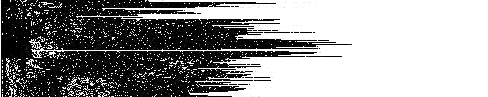
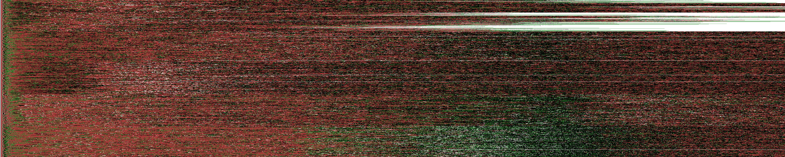
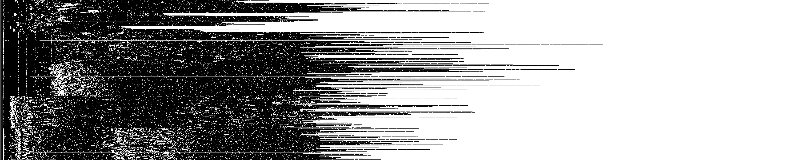
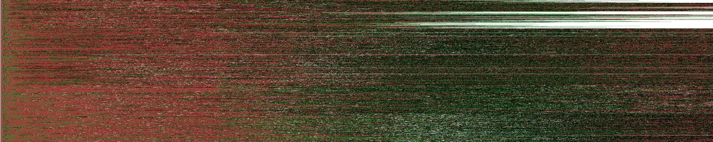

# Phase 3
Here are the final two machines: Spring and Interspace. Spring is based on
manually cleaning up the April machine from phase 2. Interspace builds upon
Spring and is manually tuned. See the full pre-print (to appear) for many more
details. Below you find the basic evaluation in the same format as for phase 2.

## Spring

Computed overhead (efficiency):
```
in total for 20000 traces:
	- 95773038 cells
	- 210% average total bandwidth
	- 18494898 sent cells (19%)
		- 4534842 nonpadding
		- 13960056 padding
		- 408% average sent bandwidth
	- 77278140 recv cells (81%)
		- 40967808 nonpadding
		- 36310332 padding
		- 189% average recv bandwidth
```

Evaluated effectiveness:
```
made 2000 predictions with 2000 labels
	threshold  0.0, recall 0.51, precision 0.46, F1 0.48, accuracy 0.58   [tp   508, fpp   240, fnp   349, tn   651, fn   252]
	threshold 0.11, recall 0.51, precision 0.46, F1 0.48, accuracy 0.58   [tp   508, fpp   240, fnp   349, tn   651, fn   252]
	threshold 0.35, recall  0.5, precision 0.49, F1 0.49, accuracy 0.59   [tp   500, fpp   205, fnp   316, tn   684, fn   295]
	threshold 0.53, recall 0.45, precision 0.59, F1 0.51, accuracy 0.62   [tp   445, fpp   116, fnp   199, tn   801, fn   439]
	threshold 0.66, recall 0.39, precision 0.65, F1 0.49, accuracy 0.63   [tp   394, fpp    73, fnp   142, tn   858, fn   533]
	threshold 0.75, recall 0.35, precision 0.71, F1 0.47, accuracy 0.63   [tp   351, fpp    45, fnp    98, tn   902, fn   604]
	threshold 0.82, recall 0.32, precision 0.76, F1 0.45, accuracy 0.63   [tp   321, fpp    31, fnp    68, tn   932, fn   648]
	threshold 0.87, recall 0.29, precision 0.82, F1 0.43, accuracy 0.62   [tp   289, fpp    20, fnp    43, tn   957, fn   691]
	threshold 0.91, recall 0.26, precision 0.86, F1  0.4, accuracy 0.61   [tp   257, fpp    14, fnp    28, tn   972, fn   729]
	threshold 0.93, recall 0.23, precision 0.88, F1 0.36, accuracy  0.6   [tp   228, fpp    12, fnp    19, tn   981, fn   760]
	threshold 0.95, recall 0.19, precision 0.92, F1 0.32, accuracy 0.59   [tp   194, fpp     6, fnp    11, tn   989, fn   800]
	threshold 0.96, recall 0.17, precision 0.93, F1 0.29, accuracy 0.58   [tp   173, fpp     6, fnp     8, tn   992, fn   821]
	threshold 0.97, recall 0.15, precision 0.94, F1 0.26, accuracy 0.57   [tp   151, fpp     2, fnp     7, tn   993, fn   847]
	threshold 0.98, recall 0.13, precision 0.95, F1 0.23, accuracy 0.56   [tp   131, fpp     1, fnp     6, tn   994, fn   868]
	threshold 0.99, recall 0.11, precision 0.96, F1  0.2, accuracy 0.56   [tp   114, fpp     1, fnp     4, tn   996, fn   885]
	threshold 0.99, recall 0.098, precision 0.97, F1 0.18, accuracy 0.55   [tp    98, fpp     0, fnp     3, tn   997, fn   902]
```

Visualized (black/white = received/sent nonpadding, red/green = received/sent padding):



## Interspace

Computed overhead (efficiency):
```
in total for 20000 traces:
	- 96245339 cells
	- 229% average total bandwidth
	- 25306497 sent cells (26%)
		- 4240612 nonpadding
		- 21065885 padding
		- 597% average sent bandwidth
	- 70938842 recv cells (74%)
		- 37877812 nonpadding
		- 33061030 padding
		- 187% average recv bandwidth

```

Evaluated effectiveness:
```
made 2000 predictions with 2000 labels
	threshold  0.0, recall 0.35, precision  0.4, F1 0.37, accuracy 0.53   [tp   351, fpp   229, fnp   297, tn   703, fn   420]
	threshold 0.11, recall 0.35, precision  0.4, F1 0.37, accuracy 0.53   [tp   351, fpp   229, fnp   297, tn   703, fn   420]
	threshold 0.35, recall 0.33, precision 0.44, F1 0.38, accuracy 0.54   [tp   331, fpp   180, fnp   242, tn   758, fn   489]
	threshold 0.53, recall 0.26, precision 0.58, F1 0.36, accuracy 0.57   [tp   258, fpp    81, fnp   109, tn   891, fn   661]
	threshold 0.66, recall 0.21, precision 0.68, F1 0.32, accuracy 0.57   [tp   206, fpp    37, fnp    59, tn   941, fn   757]
	threshold 0.75, recall 0.16, precision 0.74, F1 0.26, accuracy 0.56   [tp   159, fpp    19, fnp    36, tn   964, fn   822]
	threshold 0.82, recall 0.13, precision 0.82, F1 0.23, accuracy 0.56   [tp   131, fpp    11, fnp    17, tn   983, fn   858]
	threshold 0.87, recall  0.1, precision 0.84, F1 0.18, accuracy 0.55   [tp   103, fpp     7, fnp    12, tn   988, fn   890]
	threshold 0.91, recall 0.081, precision 0.91, F1 0.15, accuracy 0.54   [tp    81, fpp     3, fnp     5, tn   995, fn   916]
	threshold 0.93, recall 0.067, precision 0.97, F1 0.13, accuracy 0.53   [tp    67, fpp     2, fnp     0, tn  1000, fn   931]
	threshold 0.95, recall 0.056, precision 0.97, F1 0.11, accuracy 0.53   [tp    56, fpp     2, fnp     0, tn  1000, fn   942]
	threshold 0.96, recall 0.046, precision 0.96, F1 0.088, accuracy 0.52   [tp    46, fpp     2, fnp     0, tn  1000, fn   952]
	threshold 0.97, recall 0.041, precision  1.0, F1 0.079, accuracy 0.52   [tp    41, fpp     0, fnp     0, tn  1000, fn   959]
	threshold 0.98, recall 0.037, precision  1.0, F1 0.071, accuracy 0.52   [tp    37, fpp     0, fnp     0, tn  1000, fn   963]
	threshold 0.99, recall 0.032, precision  1.0, F1 0.062, accuracy 0.52   [tp    32, fpp     0, fnp     0, tn  1000, fn   968]
	threshold 0.99, recall 0.026, precision  1.0, F1 0.051, accuracy 0.51   [tp    26, fpp     0, fnp     0, tn  1000, fn   974]

```
Visualized (black/white = received/sent nonpadding, red/green = received/sent padding):

